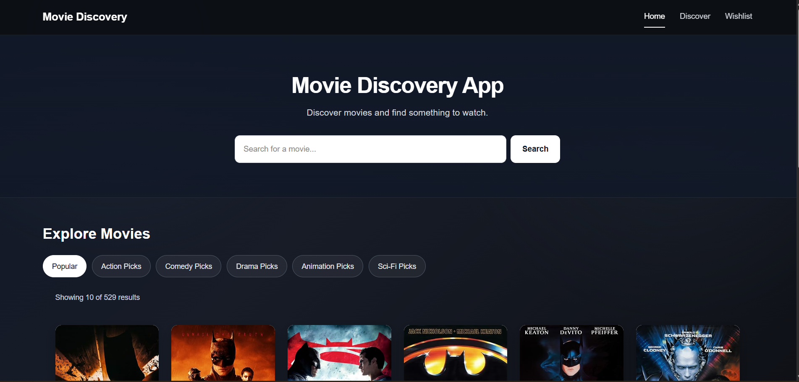
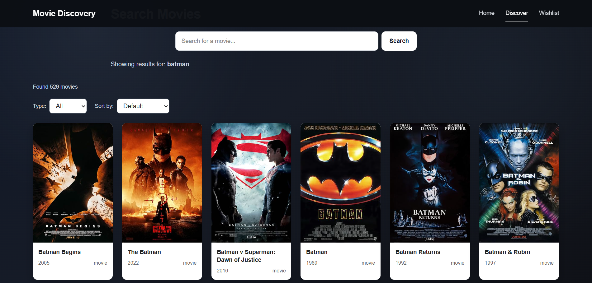
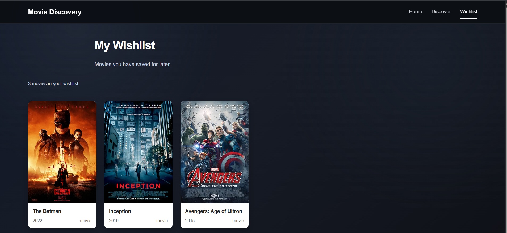

# 🎬 Movie Discovery App

A full-stack movie discovery application built with **React, Node.js, Express, MongoDB, and the OMDb API**.

The application allows users to search for movies, browse results with pagination, sort and filter results, view detailed movie information, and save movies to a **persistent wishlist**.

---

## ✨ Features

- 🔎 Search movies using the OMDb API
- 📄 Paginated search results
- ↕️ Sort movies by title and year
- 🎯 Filter available search results by movie type
- 🎬 View detailed movie information
- ❤️ Add and remove movies from a wishlist
- 💾 Persistent wishlist storage using MongoDB
- 🔙 Back navigation that preserves search context
- ⏳ Loading states
- ⚠️ Error handling
- 📭 Empty states
- 🖼️ Fallback handling for unavailable movie posters
- 📱 Responsive layout for different screen sizes
- 🔐 OMDb API key kept on the backend

---

## 🛠️ Tech Stack

### Frontend

- React
- Vite
- React Router
- Axios
- CSS

### Backend

- Node.js
- Express.js
- Axios
- Mongoose
- dotenv
- CORS

### Database

- MongoDB Atlas

### External API

- OMDb API

---

## 📁 Project Structure

```text
movie-discovery-app/
│
├── frontend/
│   ├── public/
│   ├── src/
│   │   ├── components/
│   │   │   ├── Navbar.jsx
│   │   │   ├── MovieCard.jsx
│   │   │   ├── MovieGrid.jsx
│   │   │   ├── SearchBar.jsx
│   │   │   ├── FilterBar.jsx
│   │   │   ├── SortDropdown.jsx
│   │   │   ├── Loading.jsx
│   │   │   ├── ErrorMessage.jsx
│   │   │   ├── EmptyState.jsx
│   │   │   └── MovieInfoItem.jsx
│   │   ├── pages/
│   │   │   ├── Home.jsx
│   │   │   ├── SearchResults.jsx
│   │   │   ├── MovieDetails.jsx
│   │   │   └── Wishlist.jsx
│   │   ├── context/
│   │   │   └── WishlistContext.jsx
│   │   ├── services/
│   │   │   └── api.js
│   │   ├── App.jsx
│   │   ├── main.jsx
│   │   └── index.css
│   ├── package.json
│   └── vite.config.js
│
├── backend/
│   ├── src/
│   │   ├── config/
│   │   │   └── db.js
│   │   ├── controllers/
│   │   │   ├── movieController.js
│   │   │   └── wishlistController.js
│   │   ├── models/
│   │   │   └── Wishlist.js
│   │   ├── routes/
│   │   │   ├── movieRoutes.js
│   │   │   └── wishlistRoutes.js
│   │   ├── services/
│   │   │   └── omdbService.js
│   │   └── utils/
│   │       └── normalizeMovie.js
│   ├── .env
│   ├── .env.example
│   ├── server.js
│   └── package.json
│
├── screenshots/
│   ├── home_page.png
│   ├── Discover_page.png
│   └── wishlist_page.png
│
├── .gitignore
└── README.md
```

> **Note:** `.env` contains private credentials and should never be committed to GitHub.

---

## ⚙️ Installation & Setup

Follow the steps below to run the application locally.

### 1. Prerequisites

Install the following:

- Node.js 18 or later
- npm
- Git
- MongoDB Atlas account
- OMDb API key
- VS Code or another code editor

Verify Node.js and npm:

```bash
node --version
npm --version
```

### 2. Clone the Repository

```bash
git clone https://github.com/Dev1001-ux/movie-discovery-app.git
cd movie-discovery-app
```

### 3. Backend Setup

```bash
cd backend
npm install
```

Create a `.env` file inside the `backend` folder:

```env
PORT=5000
MONGODB_URI=your_mongodb_atlas_connection_string
OMDB_API_KEY=your_omdb_api_key
```

Start the backend:

```bash
npm run dev
```

The backend will run at:

```text
http://localhost:5000
```

### 4. Frontend Setup

Open a new terminal:

```bash
cd frontend
npm install
npm run dev
```

The frontend will normally run at:

```text
http://localhost:5173
```

Make sure both the frontend and backend servers are running.

---

## 🚀 Usage

The application provides the following flow:

```text
Home
  ↓
Search Movie
  ↓
Search Results
  ├── Sort
  ├── Filter
  └── Pagination
        ↓
   Movie Details
      ├── Add to Wishlist
      └── Back to Results
              ↓
          Wishlist
              ↓
        Remove Movie
```

### 🏠 Home Page

The home page provides the starting point for discovering movies and navigating through the application.

### 🔎 Search Movies

Enter a movie name in the search bar.

The request follows this flow:

```text
React → Express Backend → OMDb API
```

The backend processes and normalizes the external API response before returning it to the frontend.

### 📄 Pagination

Search results can be explored across multiple pages. The current page is stored in the URL so the search context can be maintained while navigating.

### ↕️ Sorting

Available sorting options include:

- Title — A to Z
- Title — Z to A
- Year — Newest first
- Year — Oldest first

### 🎯 Filtering

Search results can be filtered using the available movie type filter.

### 🎬 Movie Details

Selecting a movie opens a dedicated details page containing information such as:

- Title
- Year
- Runtime
- Genre
- Plot
- Director
- Writers
- Actors
- Language
- Country
- Ratings
- Awards

### ❤️ Wishlist

Users can add movies to their wishlist from the movie details page.

Wishlist data is stored in **MongoDB**, allowing saved movies to remain available after closing and reopening the application.

Users can also remove movies from their wishlist.

### 🔙 Navigation

React Router is used for navigation. The movie details page includes a back button so users can return to their previous search results.

---

## 🔌 API Endpoints

### Movie Search

```http
GET /api/movies/search?query=batman&page=1
```

### Movie Details

```http
GET /api/movies/:id
```

Example:

```http
GET /api/movies/tt0372784
```

### Get Wishlist

```http
GET /api/wishlist
```

### Add to Wishlist

```http
POST /api/wishlist
```

### Remove from Wishlist

```http
DELETE /api/wishlist/:movieId
```

---

## 🏗️ Architecture

```text
                 ┌───────────────┐
                 │    React UI   │
                 └───────┬───────┘
                         │
                         ▼
                 ┌───────────────┐
                 │ Express API   │
                 └───────┬───────┘
                         │
              ┌──────────┴──────────┐
              ▼                     ▼
       ┌─────────────┐       ┌──────────────┐
       │   OMDb API  │       │ MongoDB Atlas│
       └─────────────┘       └──────────────┘
```

The frontend communicates with the Node.js backend rather than directly with OMDb.

The backend:

1. Receives and validates requests.
2. Communicates with OMDb.
3. Normalizes movie data.
4. Returns a clean response to React.
5. Stores wishlist data in MongoDB.

This architecture keeps the OMDb API key on the server and separates UI, API logic, external API integration, and persistence.

---

## 🧩 Error & Empty States

The application handles:

- Empty search queries
- No movies found
- Invalid movie IDs
- Invalid page numbers
- Unavailable movie posters
- Backend/API errors
- Empty wishlists
- Duplicate wishlist movies

---

## 📝 Assumptions

- OMDb is used as the external movie data provider.
- Movie information is retrieved from OMDb, while wishlist data is owned and stored by the application.
- A wishlist is currently shared at the application level because user authentication was outside the implemented scope.
- OMDb search results are paginated using the API's page-based results.
- The application focuses on movie titles rather than TV series.

---

## 📸 Screenshots

### 🏠 Home Page



### 🔎 Discover / Search Page



### ❤️ Wishlist



---

## 🔒 Security

- API credentials are stored in environment variables.
- `.env` is excluded from Git using `.gitignore`.
- The OMDb API key is used only by the backend.
- The frontend communicates with the backend instead of exposing the external API key.

**Never commit your `.env` file or API keys to GitHub.**

---

## 🧪 Testing

The following functionality was tested:

- Backend health check
- Movie search
- Search pagination
- Empty search validation
- Movie details
- Invalid movie ID handling
- Frontend movie search
- Pagination
- Movie details navigation
- Back navigation
- Wishlist add/remove
- Wishlist persistence
- Responsive UI
- Production frontend build

Build the frontend with:

```bash
npm run build
```
---

## 🤖 AI Contribution

AI tools, primarily **ChatGPT**, were used as a development assistant throughout the project.

### Areas where AI assisted

- Understanding third-party API documentation and request/response formats
- Generating initial boilerplate and project structure ideas
- Troubleshooting frontend and backend errors
- Reviewing API routes, controllers, services, and data flow
- Improving error handling and loading/empty states
- Reviewing UI and component structure
- Helping with debugging and implementation decisions

### Developer Contribution

The application architecture, technology choices, database structure, API flow, feature requirements, and final implementation were reviewed and tested during development.

AI-generated suggestions were adapted to the requirements of the assignment rather than being submitted without review. The final code was manually integrated, tested, debugged, and modified as needed.

I am able to explain the implementation, including the frontend-to-backend data flow, OMDb integration, MongoDB wishlist persistence, API design, and key technical decisions.

---

## 🔮 Future Improvements

- User authentication and individual wishlists
- Genre-based discovery
- Improved recommendation features
- Backend caching for frequently requested movies
- Request rate limiting
- Better API retry/fallback handling

---

## 🤝 Contributing

Contributions and suggestions are welcome.

1. Fork the repository.
2. Clone your fork.
3. Create a feature branch.
4. Install frontend and backend dependencies.
5. Make your changes.
6. Test the application.
7. Run the production build.
8. Commit your changes.
9. Push your branch.
10. Create a pull request.

Example:

```bash
git checkout -b feature/new-feature
git add .
git commit -m "Add new feature"
git push origin feature/new-feature
```

---

## 📞 Contact

**Devendra Kumar Gatla**

- 📧 Email: devendrakumarg1001@gmail.com
- 💻 GitHub: [Dev1001-ux](https://github.com/Dev1001-ux)
- 🔗 LinkedIn: [Devendra Kumar Gatla](https://www.linkedin.com/in/devendra-kumar-gatla-314307363/)

---

## 📄 License

This project was created as a technical assignment and learning project.
